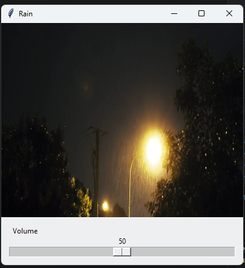

# rain
Simple rain application that adds terminal command for opening a simple rain window for stress relief

Usage:

install the rain application by running the installer.py script with "install" as argument.

run "rain" in terminal to open the rain window

## Screenshot of the Application

